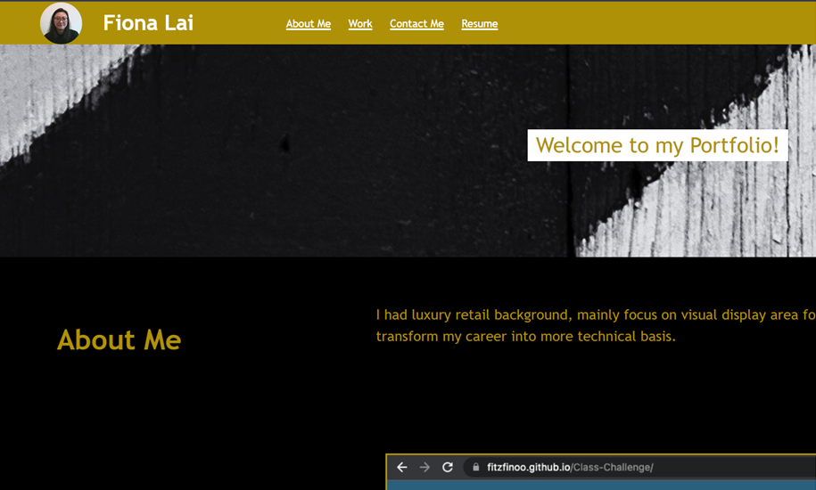

# WK2-Class-Challenge

## Description
In this chanllenge, we apply what we learn to create our first portfolio. By using Css grid, ul, image tag, link.

## Table of contents
- [Installation](#installation)
- [Usage](#usage)
- [Credits](#credits)
- [License](#license)

## Installation
First, i read the instruction, create the file system and start to build the HTML file. Secondly, i prepared the required images and solve the CSS files. At last, upload all the work to GitHub and submit the assignment.

## Usage
Open Web page and navigate to the projcects section by scrolling, or by clicking projects in the navbar. Click the link to view the project that is of interest to have it open in a new tab. 

<a href="https://fitzfinoo.github.io/WK2-Class-Challenge/"> Live Link </a>

<a href="https://github.com/Fitzfinoo/WK2-Class-Challenge"> Respo Link </a>

## Credits

Thanks to edx bootcamp team for providing starter code and mockup.

## License
MIT License

